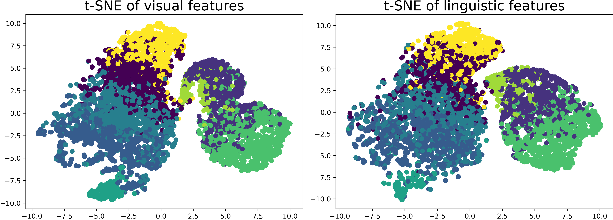
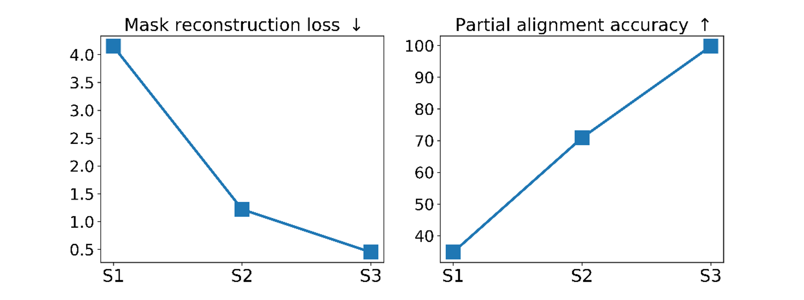

# Multimodal Evolutionary Encoder for Continuous Vision-Language Navigation


## Setup
1. Use [anaconda](https://anaconda.org/) to create a Python 3.8 environment:
```bash
conda create -n habitat python3.8
conda activate habitat
```
2. Install [Habitat-Sim](https://github.com/facebookresearch/habitat-sim/tree/v0.2.1) 0.2.1:
```bash
conda install -c aihabitat -c conda-forge habitat-sim=0.2.1 headless
```
3. Install [Habitat-Lab](https://github.com/facebookresearch/habitat-lab/tree/v0.2.1) 0.2.1:
```bash
git clone --branch v0.2.1 git@github.com:facebookresearch/habitat-lab.git
cd habitat-lab
# installs both habitat and habitat_baselines
python -m pip install -r requirements.txt
python -m pip install -r habitat_baselines/rl/requirements.txt
python -m pip install -r habitat_baselines/rl/ddppo/requirements.txt
python setup.py develop --all
```
4. Clone this repository and install python requirements:
```bash
git clone https://github.com/RavenKiller/MEE.git
cd MEE
pip install -r requirements.txt
```
5. Download Matterport3D scenes:
   + Get the official `download_mp.py` from [Matterport3D project webpage](https://niessner.github.io/Matterport/)
   + Download scene data for Habitat
    ```bash
    # requires running with python 2.7
    python download_mp.py --task habitat -o data/scene_datasets/mp3d/
    ```
   + Extract such that it has the form `data/scene_datasets/mp3d/{scene}/{scene}.glb`. There should be 90 scenes.
6. Download pre-processed episodes from [here](https://www.jianguoyun.com/p/DRKVWtQQhY--CRiE0voEIAA). Extract it into `data/datasets/`.
7. Download the depth encoder from [here](https://www.jianguoyun.com/p/DREiSbAQhY--CRjv0foEIAA). Extract the model to `data/ddppo-models/gibson-4plus-resnet50.pth`.

## Evolutionary pre-training dataset
We proposed an evolutionary pre-training strategy in this work and developed the corresponding datasets. The data collecting scripts are stored in `scripts/` with filenames like `evo_data_stage1.ipynb`.

### V1
The [v1 version](https://pan.baidu.com/s/1XnE03NaACv8JQzHdF9_1Eg) (access code: evop) contains a total of 4.8M samples of all modalities. All data is organized in HDF5 format. The total size after decompression is around 720 GB. Below is the file list:
+ stage1.zip
    + rgb.mat: contains RGB data with shape (395439, 224, 224, 3)
    + depth.mat: contains depth data with shape (417900, 256, 256, 1)
    + inst.mat: contains instruction data with shape (400250, 77), zero-padded, and tokenized
    + sub.mat: contains sub-instruction data with shape (410357, 12, 77)
+ stage2.zip
    + rgb_depth_large.mat: contains aligned RGB and depth data, a total of 230766 pairs
    + inst_sub_large.mat: contains aligned instruction and sub-instruction data, a total of 157877 pairs
    + rgb_depth.mat: contains a small debug version
    + inst_sub.mat: contains a small debug version
+ stage3.zip
    + data.mat: contains aligned (RGB, depth, instruction, sub-instruction), a total of 601038 tuples 

The data source includes:
+ stage 1: [COCO](https://cocodataset.org/#home), [VisualGenome](https://visualgenome.org/), [RGBD1K](https://github.com/xuefeng-zhu5/RGBD1K), [SceneNet Depth](https://robotvault.bitbucket.io/scenenet-rgbd.html), and [BookCorpus](https://huggingface.co/datasets/bookcorpus).
+ stage 2: [NYUv2](http://horatio.cs.nyu.edu/mit/silberman/nyu_depth_v2/nyu_depth_v2_labeled.mat), [DIODE](https://diode-dataset.org/), [TUM RGB-D](https://vision.in.tum.de/data/datasets/rgbd-dataset/download), [Bonn RGB-D Dynamic](http://www.ipb.uni-bonn.de/data/rgbd-dynamic-dataset/), [SceneNet RGB-D](https://robotvault.bitbucket.io/scenenet-rgbd.html),[Touchdown](https://github.com/lil-lab/touchdown), [map2seq](https://map2seq.schumann.pub/dataset/download/), [CHALET](https://github.com/lil-lab/chalet), [Talk the Walk](https://github.com/facebookresearch/talkthewalk), and [ALFRED](https://github.com/askforalfred/alfred).
+ stage 3: [VLN-CE](https://github.com/jacobkrantz/VLN-CE) and [EnvDrop](https://github.com/airsplay/R2R-EnvDrop).

### V2
The [v2 version](https://pan.baidu.com/s/14RmyVNhOjpKJz2IFqU_gQg) (access code: evop) contains a total of 83.9M samples of all modalities, which is a superset of v1.
All data are stored in seperated files (RGB: JPEG, Depth: PNG, Instruction: TXT, Sub-instruction: TXT). 
Collecting and loading scripts are developed in the dev branch.

Additional data sources:
[ImageNet](https://www.image-net.org/), [LAION-HighResolution](https://huggingface.co/datasets/laion/laion-high-resolution), [CC-12M](https://github.com/google-research-datasets/conceptual-12m), [C4](https://www.tensorflow.org/datasets/catalog/c4), [HM3D](https://aihabitat.org/datasets/hm3d/), [SUN3D](https://sun3d.cs.princeton.edu/), [ScanNet](http://www.scan-net.org/), [Marky-gibson](https://github.com/google-research-datasets/RxR/blob/main/marky-mT5/README.md).

## Train, evaluate and test
`run.py` is the program entrance. You can run it like this:
```bash
python run.py \
  --exp-config {config} \
  --run-type {type}
```
`{config}` should be replaced by a config file path; `{type}` should be `train`, `eval`, or `inference`, meaning train, evaluate, and test models.

Our config files are stored in `evoenc/config/`:
| File | Meaning |
| ---- | ---- |
| `evoenc.yaml` | Training model with behavior cloning |
| `evoenc_da.yaml` | Training model with DAgger |
| `evoenc_aug.yaml` | Training model with EnvDrop |
| `evoenc_p{x}.yaml` | Evolutionary pre-training stage {x}+1 |
| `evoenc_p{x}_tune.yaml` | Task fine-tuning with DAgger |

Several paths (like pre-training data folder and checkpoint paths) are configured by the above YAML files or the `evoenc/config/default.py`. Remember to change them as needed.

## Pre-trained weights
\[[stage 1](https://www.jianguoyun.com/p/DQDYoIIQhY--CRiy0_oEIAA)\] \[[stage 2](https://www.jianguoyun.com/p/DYfUQDQQhY--CRi80_oEIAA)\] \[[stage 3](https://www.jianguoyun.com/p/DfU_ZLgQhY--CRjB0_oEIAA)\] <br/> Access code: `evoenc`

We release pre-trained Enc weights after Evo. We exclude the frozen pre-extractor in these weights to reduce the storage cost. Refer to the code `evoenc/models/evoenc_policy.py` to load pre-trained weights.

## Visualization
### Unified feature spaces



### Evolved encoder performance



### Comparison with the baseline:

### Failure cases:

### Real scenes